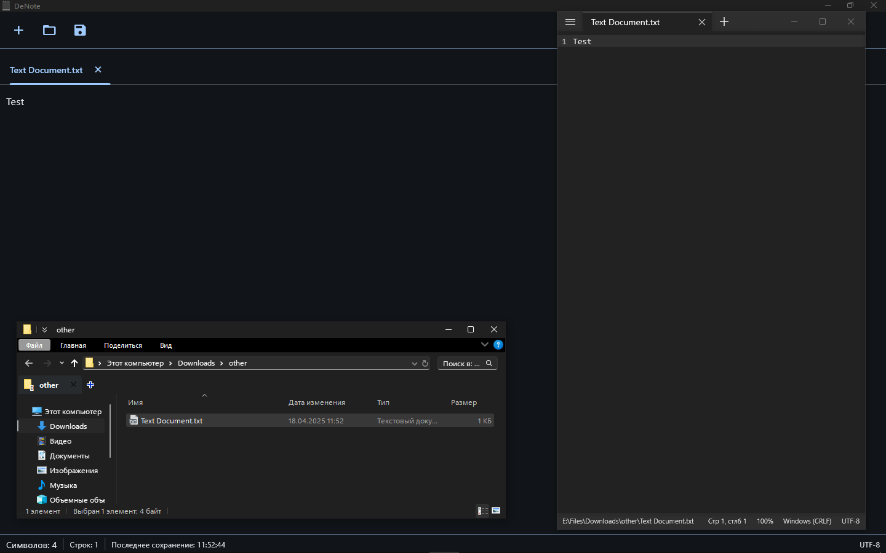
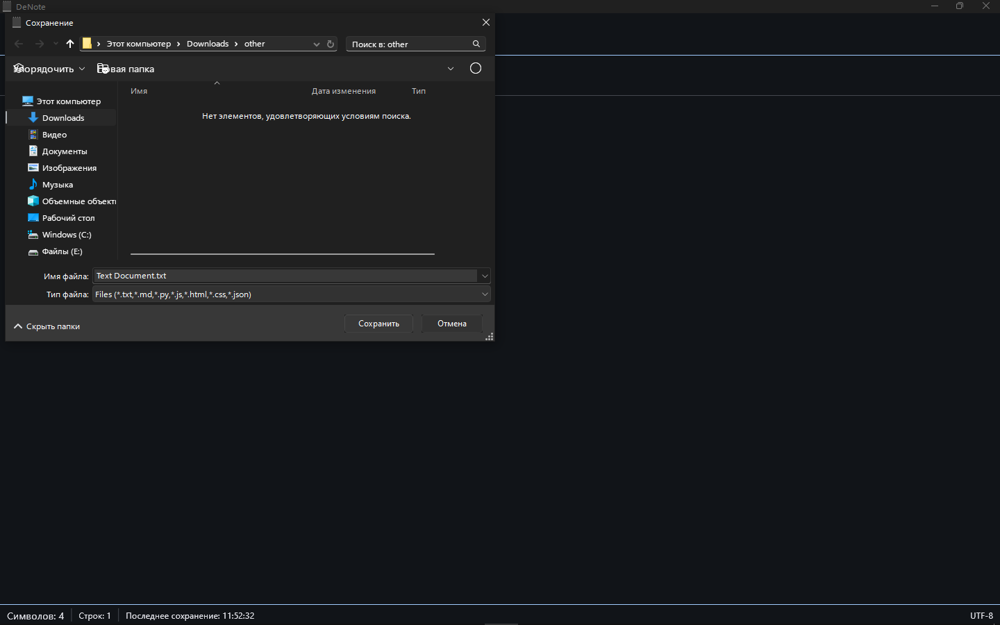
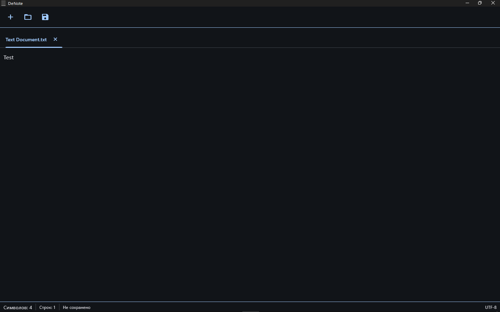
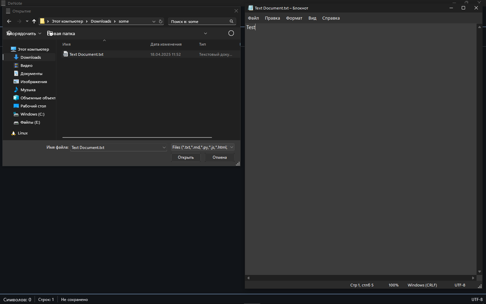
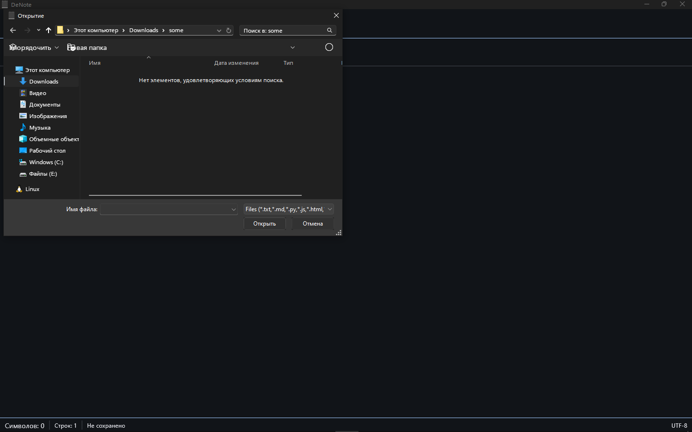
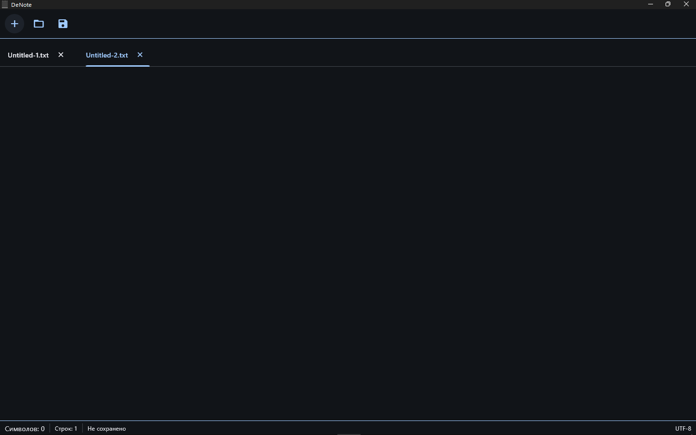
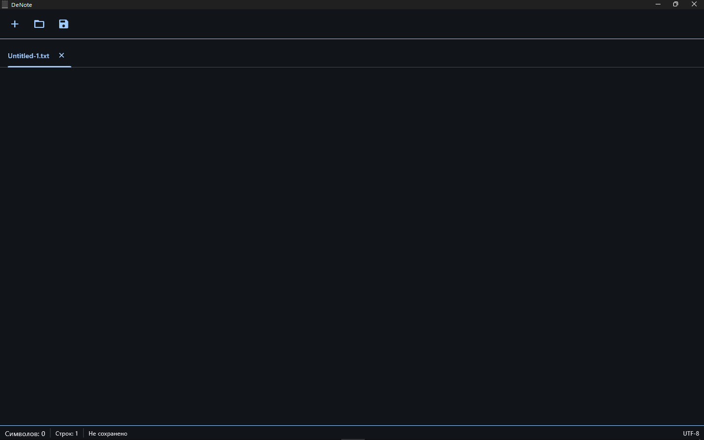

<p align="center">
  
</p>

<h1 align="center" class="outfit-text">
  DeNote
</h1>
<p align="center"><b>Современный адаптивный блокнот на Python с интерфейсом в стиле Flet</b></p>
<p align="center">
  <a style="text-decoration:none" href="https://github.com/DevNexe/DeNote/releases">
    
  </a>
</p>


**DeNote** — это минималистичный и удобный блокнот, разработанный на Python с использованием [Flet](https://flet.dev). Поддерживает вкладки, автосохранение, загрузку/сохранение файлов, уведомления, диалоги подтверждения и статусную строку. Идеально подходит как для простых заметок, так и для программирования.

## 🚀 Особенности

- ✨ Современный интерфейс с вкладками  
- 🧠 Отслеживание изменений текста в реальном времени  
- 💾 Загрузка и сохранение `.txt`, `.md`, `.py` и других файлов  
- ❗ Диалог подтверждения при закрытии изменённого файла  
- 📊 Статусная строка: количество символов, строк и время последнего сохранения  
- 🔔 Уведомления через SnackBar  
- 📁 FilePicker для открытия и сохранения файлов  
- 🛠 Поддержка нескольких открытых файлов  
- 🪟 Предупреждение при закрытии окна с несохранёнными изменениями  

## 📦 Технологии

- **Язык:** Python  
- **Фреймворк:** [Flet](https://flet.dev)  
- **Интерфейс:** Page / Tabs / Dialogs / FilePicker / SnackBar  
- **Хранение:** Локально (без базы данных)

## 📂 Поддерживаемые форматы файлов

- `.txt`  
- `.md`  
- `.py`  
- `.js`  
- `.html`  
- `.css`  
- `.json`  

## 🧠 Архитектура

Каждая вкладка содержит:
- `TextField` с текстом  
- Флаг `modified` для отслеживания изменений  
- Время последнего сохранения `last_saved`  
- Имя файла `filename`

## 📸 Скриншоты















## 🛠 Как запустить

```bash
pip install flet
python main.py
```
